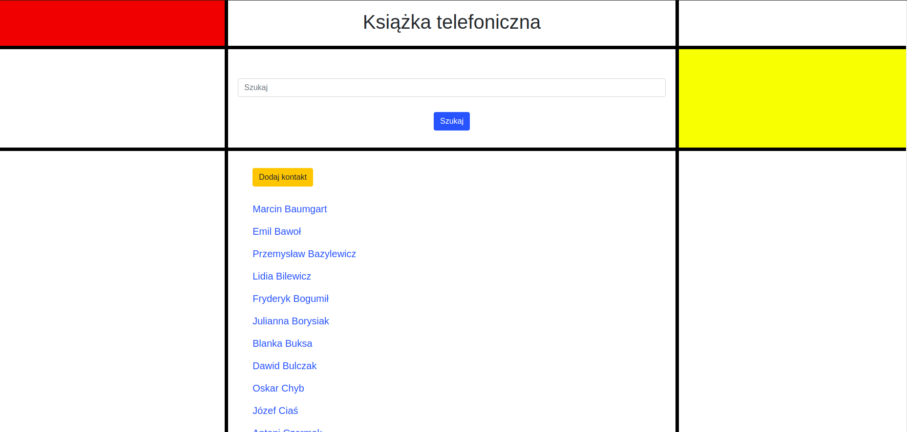

# django-phone-book
Książka telefoniczna pozwala na:
* Wyświetlenie listy osób (imię i nazwisko).
* Dodanie nowej osoby.
* Edycję osoby.
* Usunięcie osoby (tylko jeśli nie ma przypisanych telefonów lub emaili)
* Dodanie email oraz dodanie telefonu.
* Pod każdą osobą wyświetla jej telefony oraz emaile.
* Wyszukiwanie po: osobie, telefonie oraz email

 
 

## Author
Paulina Sokal

